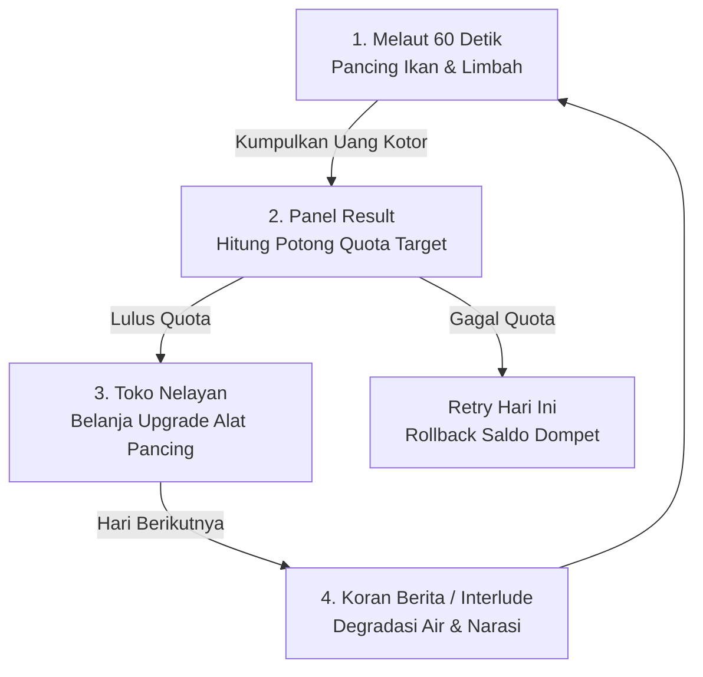

# 📄 Micro-GDD: ARUS MERAH (1-Page Document)

**Genre:** Vertical Hooking Arcade / Narrative Simulation  
**Platform:** Mobile (Android 2D Pixel Art)  
**Tema:** #ClimateCorruption (Degradasi Lingkungan & Korupsi Tambang)  
**Target Sesi:** Fast-paced Arcade (60 Detik / Hari)

---

## 🔁 1. Main Core Loop (Siklus Utama Permainan)

1. **Phase 1: Melaut (Gameplay Arcade 60 Detik)**
   Pemain meluncurkan kail memancing ikan (besar, kecil, mutasi) dan limbah tambang korosif untuk mengumpulkan **Hasil Melaut Kotor (`grossEarningsToday`)**.
2. **Phase 2: Evaluasi Quota (Panel Result)**
   Uang kotor dipotong **Quota Biaya Hidup (`targetRevenue`)**. Jika LULUS, sisa uang bersih masuk ke dompet (`walletBalance`) dan membuka Toko Shop. Jika GAGAL, pemain dipaksa *Retry* dengan fitur *Rollback Saldo*.
3. **Phase 3: Upgrade Alat (Toko Nelayan)**
   Pemain menggunakan uang bersih untuk memperluas kapabilitas kail (*Launch Speed, Retract Speed, Max Durability, Repair*).
4. **Phase 4: Perkembangan Narasi (Progression Level 1-10)**
   Kualitas air berubah (*Biru Jernih ➔ Hijau Keruh ➔ Merah Darah*), kuota membengkak, dan memicu **Dual Ending Choice** di Level 10.

---

## 🏛️ 2. Core Pillars (Pilar Utama Desain)

1. **Satisfying Arcade Physics (Responsif & Taktis):**
   Mekanik memancing kail 1 objek ala *Gold Miner* klasik dengan beban fisik (*Weight in Kg*) yang mempengaruhi kecepatan tarik dan kerusakan korosi kail.
2. **Quota & Risk Management (Lethal Company / REPO Style Economy):**
   Ketegangan finansial antara mengejar ikan berharga tinggi vs risiko memancing limbah korosif yang merusak alat pancing.
3. **Environmental Narrative & Forced Consequence:**
   Narasi degradasi lingkungan yang terintegrasi langsung ke gameplay melalui warna air laut, monolog nelayan saat mengangkat bukti korupsi, dan dilema moral ending.

---

## 🚫 3. Batasan Out of Scope (Tidak Dikerjakan)

Untuk menjaga skop pengerjaan tetap realistis pada skala Game Jam / Proyek Portofolio:

* ❌ **TIDAK ADA Multi-Hooking:** Kail hanya menarik 1 item per peluncuran (Classic Single Item Catching).
* ❌ **TIDAK ADA Procedural Generation Map Komprehensif:** Posisi spawn item acak terbatas pada koordinat kedalaman Y di `LevelDataSO`.
* ❌ **TIDAK ADA Real-Time Multiplayer / Online Leaderboard:** Game murni 100% Offline Single-Player.
* ❌ **TIDAK ADA In-App Purchase (IAP) atau Ads Integration:** Seluruh ekonomi game seimbang secara internal.
* ❌ **TIDAK ADA Cutscene Animated Video / 3D Cinematic:** Narasi hanya menggunakan format **Chatbox / Dialogue Box TextMeshPro** sederhana & ilustrasi 2D.
