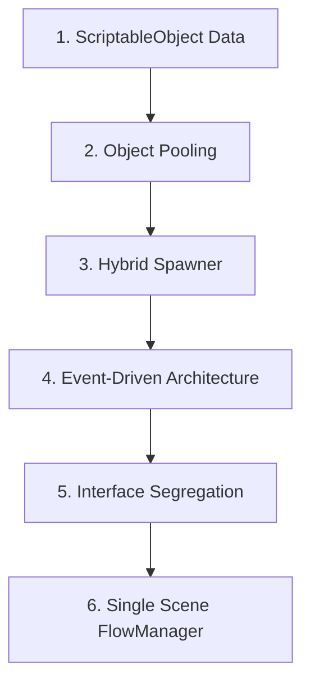

# Roadmap & Skala Prioritas Pengembangan Game: ARUS MERAH

Dokumen ini berisi peta jalan (roadmap) dan skala prioritas pengerjaan kelanjutan game **Arus Merah** dengan fokus pada peningkatan kualitas arsitektur Unity untuk portofolio.

---

## 🎯 Fokus Utama Arsitektur (Core Architecture)

Pengembangan diprioritaskan pada **Clean Code, Decoupling, & Data-Driven Architecture**:

---

## 📌 breakdown Fitur Utamanya vs Opsional

### 🔴 CORE FOCUS (Wajib untuk Portofolio Arsitektur)

1. **ScriptableObject Data (`ItemTypeSO` & `LevelDataSO`)**
   - Pemisahan data statistik item (harga, berat, korosi) & konfigurasi level (posisi pasti vs acak).
2. **Object Pooling System (`ObjectPooler.cs`)**
   - Menghindari `Instantiate` & `Destroy` berulang untuk menghemat memori & performa mobile.
3. **Hybrid Spawner (`LevelSpawner.cs`)**
   - Menangani pembentukan item pasti (Surat Rahasia Korupsi) dan item acak (ikan & sampah).
4. **Event-Driven Architecture (C# Actions / Observer Pattern)**
   - Menghubungkan gameplay (`HookMainSystem`) dengan UI dan Manager lainnya secara terpisah (*decoupled*).
5. **Interface Segregation (`ITakeAbleObject`, `IHookable`, `ICorrosive`, `ISpecialEffect`)**
   - Penerapan prinsip SOLID untuk pemisahan peran tiap tipe objek laut.
6. **State Machine Game Flow (`FlowManager.cs` + `CanvasGroup`)**
   - Pengatur transisi UI instan & mulus (News -> Gameplay -> Result -> Shop) dalam 1 Scene.
7. **Checkpoint Uang & Upgrade Shop (`GameData.cs` & `ShopManager.cs`)**
   - Manajemen restart level tanpa bug duplikasi uang & integrasi upgrade eksponensial.

---

### 🟡 STRETCH GOALS (Fitur Opsional / Polish Tambahan)

*Fitur di bawah ini dapat dikerjakan setelah sistem utama di atas rampung 100%:*

* [ ] **Point 3: Floating Text System** (Muncul teks `+$100` melayang saat item terangkat).
* [ ] **Point 4: Dynamic Water Shader / Color Lerp** (Perubahan warna air laut dari biru ke merah karat).
* [ ] **Point 5: Screen Shake & Haptic Feedback** (Efek getar & goyang kamera saat menarik objek berat).
* [ ] **Point 6: JSON Save/Load System** (Penyimpanan progress tingkat lanjut dengan data terenkripsi/JSON).

---

## 📅 Urutan Langkah Pengerjaan (Actionable Roadmap)

- [x] **Langkah 1:** Menyiapkan `ItemTypeSO.cs` & Interface Objek (`IHookable`, `ICorrosive`).
- [ ] **Langkah 2:** Menyiapkan `ObjectPooler.cs`.
- [ ] **Langkah 3:** Menyiapkan `LevelDataSO.cs` & `LevelSpawner.cs`.
- [ ] **Langkah 4:** Menyiapkan `GameplayEvents.cs` (Event-Driven System).
- [ ] **Langkah 5:** Menyiapkan `UIPanel.cs` (`CanvasGroup`) & `FlowManager.cs`.
- [ ] **Langkah 6:** Menyiapkan `ShopManager.cs` & Logika Checkpoint Uang.
