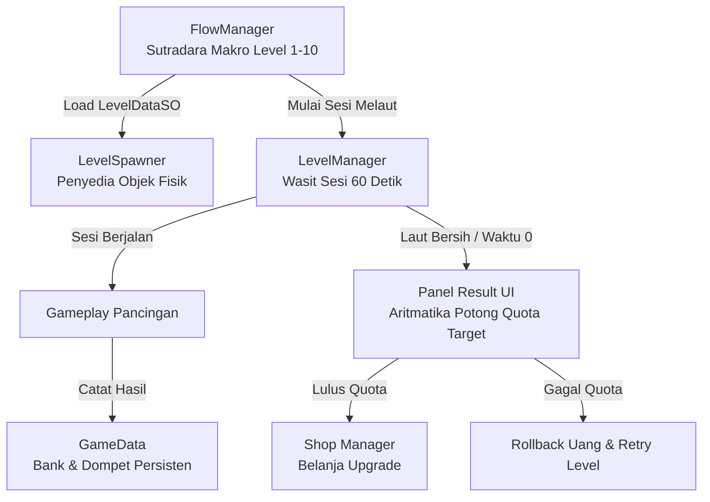

# Technical Design Document (TDD): ARUS MERAH (Master Architecture Edition)

**Nama Game:** ARUS MERAH  
**Platform:** Mobile / Android  
**Gaya Visual:** Pixel Art 2D (Vertical Hooking Arcade)  
**Arsitektur Utama:** Single Scene State Machine, Data-Driven Architecture (ScriptableObjects), Object Pooling, Observer Pattern (C# Actions/Events), & Decoupled Manager System.

---

## 🏛️ 1. Ikhtisar Arsitektur & Pembagian Peran Manager

Arsitektur dikembangkan secara *Decoupled* di mana setiap Manager memiliki **Single Responsibility (SRP)** yang tegas:



### 📋 Matriks Pembagian Tugas Manager:
1. **`FlowManager` (Sutradara Makro Loop):** Mengatur alur dari Level 1 ➔ Level 10, transisi Koran Berita, Layar Result, Toko Shop, Interlude, hingga Dual Ending.
2. **`LevelManager` (Wasit Sesi Gameplay Mikro):** Mengatur countdown timer (60s ➔ 0s) saat melaut, menghitung akumulasi item di laut (`totalCollectedItems` vs `totalSpawnedItems`), dan mentrigger evaluasi instan saat laut bersih.
3. **`LevelSpawner` (Penyedia Objek Fisik):** Memanggil prefab ikan/sampah dari `ObjectPooler` dan memosisikannya di kedalaman laut.
4. **`GameData` (Bank & Dompet Persisten):** Menyimpan dompet uang bersih (`walletBalance`), hasil pancingan kotor (`grossEarningsToday`), snapshot uang awal hari (`walletSnapshotAtStart`), dan statistik upgrade.
5. **`UIManager` & `UIPanel` (Pusat Antarmuka UI):** `UIManager` bertindak sebagai Hub Coordinator teks/slider, sedangkan `UIPanel` menangani *CanvasGroup Crossfade* pada masing-masing layar UI.

---

## 💰 2. Spesifikasi Skema Ekonomi Potong Quota / Target (REPO & Lethal Company Style)

Sistem keuangan menggunakan skema **Uang Kotor (Gross) ➔ Potong Quota (Expense) ➔ Uang Bersih (Net Wallet)**:

```mermaid
graph LR
    Gameplay[Gameplay Melaut] -->|Kumpulkan| Gross[Uang Kotor: grossEarningsToday]
    Gross --> Result[Panel Result]
    Result -->|Aritmatika: Gross - Target| Check{Gross >= Target?}
    
    Check -- YA (LULUS) -- Net[Uang Bersih: walletBalance<br>Tombol 'Lanjut Ke Shop' = INTERACTABLE]
    Check -- TIDAK (GAGAL) -- Rollback[Set: Uang = Snapshot Awal Hari<br>Tombol 'Lanjut Ke Shop' = NON-INTERACTABLE]

    Net --> Shop[Shop Nelayan: Belanja Upgrade]
```

### 🔢 Formula Aritmatika di Panel Result:
1. **Awal Hari (Level Start):**  
   `walletSnapshotAtStart = walletBalance;`  
   `grossEarningsToday = 0;`
2. **Saat Melaut:**  
   Pemain memancing item ➔ `grossEarningsToday += itemValue;`
3. **Di Layar Panel Result:**  
   * **Jika `grossEarningsToday >= targetRevenue` (Lulus Quota):**  
     `netProfit = grossEarningsToday - targetRevenue;`  
     `walletBalance = walletSnapshotAtStart + netProfit;`  
     *Tombol "Lanjut ke Shop" / "Next Level" = **INTERACTABLE** (Aktif).*
   * **Jika `grossEarningsToday < targetRevenue` (Gagal Quota):**  
     `walletBalance = walletSnapshotAtStart;` (Rollback otomatis ke saldo awal hari)  
     *Tombol "Lanjut ke Shop" = **NON-INTERACTABLE** (Mati, Wajib Retry).*

---

## 📁 3. Dokumentasi 16 Script Projek Aktual

---

### A. ScriptableObjects (`Assets/Scripts/ScriptableObjects/`)
1. **`ItemTypeSO.cs`**: Menampung statistik generik item (Nama, kategori, sprite, harga jual, berat Kg, damage korosi, data renang, teks monolog).
2. **`LevelDataSO.cs`**: Menampung data level (Nomor level, target revenue, time limit, warna air, flag forced failure, daftar spawn item).
3. **`CutSceneDataSO.cs`**: Menampung data narasi koran, selebaran loker, dan tombol pilihan ending.

### B. Interface (`Assets/Scripts/Interface/`)
4. **`IHookAble.cs`**: Interface terpadu untuk semua objek pancingan (`ItemTypeData`, `ItemWeightInKg`, `CorrotionDamageToClaw`, `OnCaughtByClaw`, `SellObject`, `DestroyObject`).

### C. GamePlay (`Assets/Scripts/GamePlay/`)
5. **`HookMainSystem.cs`**: Mengatur peluncuran kail, tarikan, tali `LineRenderer`, penyesuaian kecepatan berdasarkan berat item, dan pengurangan durabilitas.
6. **`ClawRotateSystem.cs`**: Mengatur ayunan rotasi kail ke kiri dan kanan saat diam.
7. **`ItemInstance.cs`**: Komponen pada prefab item yang mengimplementasikan `IHookAble` dan mendaur ulang objek ke `ObjectPooler`.
8. **`ItemPatrolMovement.cs`**: Mengatur gerakan renang patroli horizontal untuk ikan (flip sprite & batas renang).

### D. Managers (`Assets/Scripts/Managers/`)
9. **`GameData.cs`**: Singleton persisten penyimpan dompet bersih (`walletBalance`), pancingan kotor (`grossEarningsToday`), snapshot saldo (`walletSnapshotAtStart`), dan upgrade stats.
10. **`LevelManager.cs`**: Wasit sesi melaut (Countdown timer 60s), pemantau kebersihan laut (`totalCollectedItems` vs `totalSpawnedItems`), dan pelaksana evaluasi instan.
11. **`LevelSpawner.cs`**: Spawner Hybrid yang memunculkan item acak via `ObjectPooler` dan menyiarkan `OnItemSpawned`.
12. **`ObjectPooler.cs`**: Singleton Object Pooler berbasis FIFO Queue & Dictionary untuk mengeliminasi GC Spike di Android.
13. **`FlowManager.cs`**: State Machine pengatur alur dari Level 1 s/d Level 10, transisi Koran, Panel Result, Shop, Interlude, dan Dual Ending.
14. **`UpgradeManager.cs`**: Pengelola transaksi upgrade toko nelayan (Launch speed, Retract speed, Max durability, Repair) dengan pemotongan langsung dari `walletBalance`.

### E. UI System (`Assets/Scripts/UI/` & `Assets/Scripts/`)
15. **`UIManager.cs`**: Hub Coordinator UI yang mengelola HUD Gameplay, UI Result, dan CanvasGroup Crossfade Shop.
16. **`UIPanel.cs`**: Script penanggung jawab transisi halus (*CanvasGroup Crossfade*) untuk layar UI individual.

---

## 📊 4. Spesifikasi Progression & Dual Ending (#ClimateCorruption)

```
Level 1-3  (SURPLUS)  : Laut Bersih, Ikan Melimpah -> Bebas Menabung Uang Bersih & Beli Upgrade.
Level 4-6  (PAS-PASAN): Laut Keruh, Ikan Berkurang -> Hasil Pancingan Pas untuk Biaya Hidup.
Level 7-9  (DEFISIT)  : Laut Merah Beracun, Asam Korosif -> Hasil Minus, Menombok dari Tabungan.
Level 9.5  (INTERLUDE): Temukan Bukti Korupsi & Anggota Keluarga Masuk Rumah Sakit.
Level 10   (FORCED FAIL): Laut Mati Total, Biaya RS $1.200+ -> Trigger Dual Ending Choice.
```

* **Opsi A: "Jalur Demo" (*The Resistance*)** ➔ Aksi dibungkam beton pabrik, demo ricuh, beberapa warga (termasuk pemain) ditangkap aparat. Teks: *"Suaramu dibungkam oleh beton-beton pabrik... Menjaga iklim dianggap tindakan kriminal."*
* **Opsi B: "Jalur Damai / Kerja Tambang" (*The Betrayal & Submission*)** ➔ Uang berobat keluarga didapat dari suap/kontrak, tetapi dicap Pengkhianat oleh warga desa dan bekerja di smelter. Teks: *"Jaringmu kini menjadi helm proyek... Kamu menjadi pengkhianat bagi warga dan bagian dari rantai yang meracuni sumur keluargamu."*
